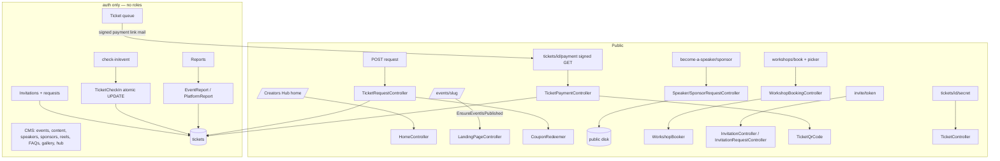

# Code / Functional / Performance Audit — Event & Ticketing Platform (whole project)

Audit prompt: `claude-code-audit-prompts/laravel-mvc/01-code-functional-performance-audit-claude-code.md`
Date: 2026-09-26 · Branch `main` @ `1d00644` · Working tree clean before the audit · **Read-only** — no source, config, schema or dependency changes. Files created: this report, `code-review-findings.json`, and the commit-scoped set under `audits/invitations-4f3ff4c-1d00644/`.

---

## 1. Executive Summary

A well-engineered Laravel 12 MVC application. It has a clear domain model, consistent house style (`declare(strict_types=1)`, FormRequests, event-scoped controllers, service classes for the tricky parts), 660 passing tests, clean Pint output, and efficient public pages (3–17 queries each, no N+1). The riskiest domain operations — check-in, workshop booking, and invitation submission and review — are implemented with atomic conditional updates or row locks.

The problems are concentrated in **state-changing admin actions and data integrity**, not in the public site:

| # | Finding | Impact | Verified |
|---|---|---|---|
| CR-03 | Approve/reject for tickets, speakers and sponsors has **no server-side "still pending" check**. Approving an already-issued ticket reverts it to `payment_pending`, so the attendee is **refused at the door**. Approving a sponsor twice creates **two sponsors**. | High | **Runtime-reproduced** (rolled-back transaction) |
| CR-02 | Deleting a ticket type **cascade-deletes every ticket of that type**, including paid and checked-in ones, with no guard. | High | Static (migration + controller) |
| CR-01 | Invitation tickets are counted as **collected revenue** at full price. | High | Static |
| CR-04 | Coupon `usage_limit` can be exceeded under concurrency (check-then-increment). | Medium | Static |
| CR-05/06 | Payment completion is a stub (a GET link issues the ticket). It also has a double-visit race, and an email failure after the state change is never retried. | Medium | Static |
| CR-07 | No pagination anywhere in the admin. | Medium | Static + measured |

**Production readiness: YES WITH MINOR ISSUES — conditional on** fixing CR-02 and CR-03 before event day, and on CR-06 (payment is a stub) being an accepted business decision for this launch. If real card payments are expected, the answer is **NO** until a gateway is integrated.

| Severity | Count |
|---|---|
| High | 3 (CR-01, CR-02, CR-03) |
| Medium | 6 (CR-04, CR-05, CR-06, CR-07, CR-08, CR-17) |
| Low | 8 (CR-09 – CR-16) |
| Informational | 1 (CR-18 event deletion wipes tickets without a count warning) |

## 2. Application Architecture

**Stack:** Laravel 12.69.1 · PHP 8.3.21 · MySQL (dev) / SQLite in-memory (tests) · Blade + Alpine.js 3 + Tailwind v4 + Sass via Vite 7 · GSAP · CKEditor 5 (admin rich text, purified server-side with `mews/purifier`) · `endroid/qr-code` · `propaganistas/laravel-phone` + `intl-tel-input` · `html5-qrcode` (check-in) · ApexCharts (reports) · SweetAlert2. Session/cache/queue use the `database` driver; mail uses `log` locally. There are no queued jobs, events, listeners, policies or scheduled tasks. Deployment: Plesk (`public/.user.ini`); `public/build` is gitignored and must be built on the server.



## 3. Route & Feature Inventory

173 routes (`php artisan route:list --except-vendor`):
- **Public (27):** the home page, the events list, per-event pages (landing, agenda, awards, speakers, workshops), workshop booking, the ticket-request form, speaker and sponsor applications, contact, newsletter, invitations, the ticket view and the payment stub.
- **Check-in (3):** behind `auth`.
- **Admin (143):** behind `auth`. CRUD for events and every CMS section, the ticket/speaker/sponsor/invitation review queues, reports and CSV export, and the Creators Hub site content.

The trace below covers the main flows.

| Feature | Route → Controller | Validation | Service | Tables | Tests |
|---|---|---|---|---|---|
| Ticket request | `POST events/{event}/request` → `TicketRequestController@store` | `TicketRequestStoreRequest` (dynamic per-event fields) | `CouponRedeemer` | tickets, ticket_request_answers | `TicketRequestSubmissionTest`, `TicketRequestFormTest`, `DiscountCouponTest` |
| Review → payment link | `PATCH admin/…/ticket-requests/{ticket}/{status}` | `in:approved,rejected` | — | tickets | `Admin/TicketRequestQueueTest` |
| Payment (stub) → issue | `GET tickets/{ticket}/payment` (signed) | signature | `WorkshopBooker`, `TicketQrCode` | tickets | **none** — only the link inside the approval email is asserted (`tests/Feature/TicketDesignTest.php:121`) |
| Ticket page | `GET tickets/{ticket}/{ticketId}` | `hash_equals` | `TicketQrCode` | tickets | `TicketDesignTest` |
| Check-in | `POST check-in/{event}[/scan]` | `qr_code max:4096` | `TicketCheckIn` (atomic) | tickets | `Admin/TicketCheckInTest` |
| Workshop booking | `POST events/{event}/workshops/book` (throttle 10/min), picker | ref + key | `WorkshopBooker` (row locks) | workshop_bookings | `WorkshopBookingTest` |
| Speaker/sponsor applications | `POST become-a-speaker/sponsor` | FormRequest + image | `HandlesMediaUploads` | speaker_requests, sponsor_requests | `SpeakerRequestTest`, `SponsorRequestTest` |
| Invitations | see commit report | | | invitations, invitation_requests | 5 test files |
| Reports + CSV | `admin/events/{event}/reports[/export]`, `admin/reports` | — | `EventReport`, `PlatformReport` | tickets | `EventReportTest`, `PlatformReportTest` |
| CMS rich text | many admin forms | FormRequests | `SanitizedRichText` cast / `RichText::clean` | many | `RichTextTest`, CRUD tests |

## 4. Functional Verification Matrix

| Journey | Status | Evidence |
|---|---|---|
| Full test suite | VERIFIED WORKING | `php artisan test` → 660 passed, 1587 assertions |
| Code style | VERIFIED WORKING | `pint --test` → passed |
| Migrations applied on dev DB | VERIFIED WORKING | `migrate:status` → 55 Ran |
| Public pages render (home, events, landing, speakers, workshops, agenda) | VERIFIED WORKING | local kernel GET, all 200 (§14) |
| Admin pages render (dashboard, reports, queues, invitations, content, check-in) | VERIFIED WORKING | local kernel GET as admin, all 200 |
| Ticket request → approve → pay → issue → check-in | PARTIALLY VERIFIED | request, approve and check-in are covered by feature tests; **the pay → issue step is untested** (CR-17); not run in a browser |
| Re-approve an issued ticket | **FAILED** | reproduced: status became `payment_pending` (CR-03) |
| Approve the same sponsor request twice | **FAILED** | reproduced: 2 sponsors created (CR-03) |
| Coupon usage limit under concurrency | NEEDS VERIFICATION | static race (CR-04); not load-tested |
| Delete a ticket type that has tickets | FAILED (static) | cascade removes tickets (CR-02) |
| Revenue with invitation tickets | FAILED (static) | CR-01 |
| Email delivery | NOT TESTABLE LOCALLY | `MAIL_MAILER=log` |
| Payment gateway | NOT TESTABLE LOCALLY | not implemented (CR-06) |
| Arabic completeness | PARTIALLY VERIFIED | 18 keys missing (CR-10) |

## 5. Confirmed Bugs

### CR-03 — Review actions don't enforce "still pending" (High)
- **Where:**
  - `app/Http/Controllers/Admin/TicketRequestQueueController.php:49-59`: status is set unconditionally.
  - `app/Http/Controllers/Admin/SponsorRequestController.php:55-64` and `:72`.
  - `app/Http/Controllers/Admin/SpeakerRequestController.php:42-53` and `:61`.
- The Approve/Reject buttons appear only for pending rows (`resources/views/admin/ticket-requests/index.blade.php:67`). The server doesn't check, so a double-click, a stale tab, two admins, or a replayed request goes straight through.
- **Reproduction** (tinker, inside `DB::beginTransaction()`/`rollBack()`): create a `TicketIssued` ticket, then `PATCH …/ticket-requests/{id}/approved` → 302, and the status is now `payment_pending`. `PATCH …/sponsor-requests/{id}/approved` twice → 2 sponsor rows.
- **Expected:** a second review is a no-op. **Actual:** the issued ticket is demoted. `TicketCheckIn` only admits `TicketIssued` tickets (`app/Services/TicketCheckIn.php:53`), so the attendee is refused. The guest also gets a new payment email; paying again rotates `ticket_id`, which invalidates the QR code already in their inbox. Duplicate speakers/sponsors appear on the landing page.
- **Fix:** do what the invitation review already does (`Admin/InvitationRequestController.php:52-57`): lock the row, return early unless the status is Pending, and add tests for double submission.

### CR-02 — Deleting a ticket type deletes its tickets (High)
- **Where:** `database/migrations/2026_08_01_100000_create_tickets_table.php:16` (`ticket_type_id … cascadeOnDelete()`) and `app/Http/Controllers/Admin/TicketTypeController.php:61`, which calls `$ticketType->delete()` with no check.
- **Impact:** one click in the admin permanently removes every ticket of that tier — paid, issued and checked-in — plus their form answers and workshop bookings. Invitations (`…150004…:19`) and their requests go the same way.
- The existing test `tests/Feature/Admin/TicketTypeCrudTest.php:187-190` asserts that deletion succeeds, but not what happens to the tickets.
- **Fix:** `restrictOnDelete()` via a new migration, block deletion when `tickets()->exists()`, and point the admin to the existing `is_active` flag instead.

### CR-01 — Invitation tickets inflate revenue (High)
Details in `audits/invitations-4f3ff4c-1d00644/CODE_REVIEW_REPORT.md` (INV-C01). The price is set at `app/Http/Controllers/Admin/InvitationRequestController.php:71,77`; revenue is summed at `app/Services/EventReport.php:75,94` and `app/Services/PlatformReport.php:43,66,171`.

### CR-04 — Coupon usage limit is check-then-act (Medium)
`CouponRedeemer::find()` checks `times_used < usage_limit` (`app/Services/CouponRedeemer.php:30`, `app/Models/DiscountCoupon.php:61`). Later, `recordUse()` increments unconditionally (`CouponRedeemer.php:61`, called from `app/Http/Controllers/TicketRequestController.php:55`), and there's no row lock. Two requests arriving at once can both see 1 use left and both redeem it. The single-request limit is tested (`tests/Feature/DiscountCouponTest.php:117`); the concurrent case isn't. **Fix:** a conditional increment, `->where('times_used', '<', usage_limit)->increment()`, checking that one row was affected; otherwise quote full price.

### CR-06 — Payment is a stub: the signed link issues the ticket without charging (Medium)
`app/Http/Controllers/TicketPaymentController.php:18` (`// will be updated once we integrate with payment gateway`) and `routes/web.php:90`. Opening the approval email's link immediately marks the ticket paid (`payment_method = 'payment_link'`) and issues it. This is a known placeholder. If tickets are meant to be sold, it's a production blocker; if early releases are free or paid offline, record that as an accepted decision. The link is a GET, so an email security scanner that pre-fetches links can "complete payment" on the attendee's behalf (also SEC-03).

### CR-05 — Payment completion: double-visit race, and a lost email on failure (Medium)
`app/Http/Controllers/TicketPaymentController.php:22-39` reads the status, then writes `ticket_id = Str::random(40)` without a lock or conditional update.
- Two concurrent visits (a double click, or an email link scanner plus the user) both pass the `PaymentPending` check. Each writes a different `ticket_id` and sends its own `TicketIssued` email, so one of those QR codes is already invalid.
- If `Mail::send` (line 39) throws after the update, the user sees a 500 error. On refresh the page reports "complete", because the status is no longer `PaymentPending`, and the ticket email is never re-sent.

**Fix:** a conditional `UPDATE … WHERE status = payment_pending`, and a queued mailable dispatched `afterCommit`.

## 6. MVC / Blade Findings

- Views are well factored: partials per landing section, `x-admin.*` components, and dynamic components for sponsor tiles.
- Every rich-text output (`{!! !!}`, 19 sites) reads from a field sanitized on write; that was fixed and verified earlier. Admin list previews use `strip_tags`.
- **CR-16 (Low):** status labels are built three ways: `__(ucfirst($value))` in `resources/views/agenda/show.blade.php:43` and `resources/views/admin/invitation-requests/index.blade.php:36`, enum `label()` elsewhere, and ad-hoc strings. The first style caused the `"Used"` translation clash fixed in `1d00644`. Standardize on enum `label()`.
- **CR-10 (Low, Localization):** 18 strings have no Arabic entry. Two keys exist in `en.json` only (`"Thank you for your interest in"`, `"Unfortunately, we're unable to approve your ticket request at this time."`). Keys used by views but missing from `ar.json`:
  - from this session's features: `e.g. Ahmed Hassan`, `name@example.com`, `Enter your code`, `Follower count`, `View All Speakers`, `Featured`, `Require influencer category on ticket requests`, `Featured on the landing page (up to 4)`, `Only :max speakers can be featured at once.`;
  - from invitations: `Category`, `Social`, `We received your request`, `We received your request.`, `Influencer Category`, `Other`, `Tell us your category`, `TikTok`.

  `HubTranslationCoverageTest` guards the Creators Hub strings only; there's no equivalent for the event and admin views.
- **CR-15 (Low):** `app/Http/Requests/Admin/EventRequest.php:25` validates `slug` only as `string|max:255`. Spaces or `/`, `?`, `#` produce broken event URLs; add `alpha_dash`. (Security angle in SEC-09.)

## 7. Controller / Service Findings

- **CR-08 (Medium, Maintainability) — ticket issuance exists in three places:** `TicketPaymentController.php:26-39`, `Admin/InvitationRequestController.php:80-93`, and the ticket-number format again at `TicketRequestController.php:124-128`. One `TicketIssuer` service would also be the natural place to fix CR-05 and INV-C02.
- **CR-12 (Low):** approving a speaker request copies its `photo_path` to the new speaker (`app/Http/Controllers/Admin/SpeakerRequestController.php:49`). Deleting that speaker later deletes the shared file (`app/Http/Controllers/Admin/SpeakerController.php:61`), which breaks the image on the archived request. Copy the file on approval, or skip deletion when another row references the path.
- **CR-13 (Low):** `bio_ar`/`bio_en` on public speaker applications have no `max` (`app/Http/Requests/SpeakerRequestStoreRequest.php:24-25`); only `post_max_size` (30 MB, `public/.user.ini`) bounds them.
- Controllers are thin elsewhere. Good service extraction for the hard parts: `TicketCheckIn`, `WorkshopBooker`, `CouponRedeemer`, `EventReport`, `PlatformReport`, `TicketQrCode`.

## 8. Eloquent / Database Findings

- **Indexes** (from `Schema::getIndexes`): `tickets` has unique `ticket_id` and `ticket_number`, plus indexes on event, type, coupon and category. `workshop_bookings` has unique (`ticket_id`, `workshop_id`); `newsletter_subscribers` unique (`event_id`, `email`); `discount_coupons` unique (`event_id`, `code`); the request tables index `status`. That's adequate for current query shapes.
- **Cascades:** CR-02, and also `event_id … cascadeOnDelete` on tickets (`…create_tickets_table.php:15`). **CR-18 (Informational):** deleting an event (`app/Http/Controllers/Admin/EventController.php:69`) wipes all its tickets. That's arguably intended, but it deserves an "event has N paid tickets" confirmation.
- **Dead enum value (CR-11):** `TicketStatus::Approved` (`app/Enums/TicketStatus.php:10`) is never assigned. Approval goes straight to `PaymentPending`.
- No N+1 was found on any measured page (§14).

## 9. Validation / Forms Findings

- FormRequests are used consistently. Public phone numbers use `Phone::international()`; names have a Unicode letter regex; dynamic per-event fields build rules per type (`TicketRequestStoreRequest`).
- `Rule::in` with event-scoped category IDs is used correctly for "Other".
- Browser validation is never the only check.
- CR-13 and CR-15 above.

## 10. Auth Architecture Findings

- A single `auth` guard with no roles. The check-in "portal" (`routes/web.php:99-103`) uses the same `User` login as the admin (`routes/web.php:110`), so door staff hold full admin rights. That conflicts with `.claude/skills/event-domain.md:79` ("A separate QR registration team portal … distinct from the admin dashboard"). Details and severity are in `SECURITY_AUDIT_REPORT.md` (SEC-02).
- Ownership: every nested admin controller checks that the model belongs to the event (the `assertBelongsToEvent` pattern). This is consistent and tested.

## 11. Queue / Event / Scheduler Findings

- No jobs, listeners or scheduled tasks. `QUEUE_CONNECTION=database` is configured but unused.
- Every email is sent synchronously inside the HTTP request, so SMTP latency adds directly to response time and failures aren't retried: ticket received, approved, rejected, issued, and speaker/sponsor/invitation confirmations. Moving these to queued mailables with `afterCommit` would fix CR-05 and INV-C02 at the same time.
- Nothing prunes expired invitations, old sessions (DB session garbage collection is lottery-based), or rejected requests.

## 12. Dead & Unused Code

| Item | Evidence | Classification |
|---|---|---|
| `resources/views/admin/check-in/index.blade.php`, `result.blade.php` | no `view('admin.check-in…')` anywhere; replaced by `resources/views/check-in/index.blade.php` | CONFIRMED DEAD |
| `resources/views/welcome.blade.php` | not referenced; `/` → `HomeController` | CONFIRMED DEAD |
| `resources/js/bootstrap.js` | not imported by `resources/js/app.js` or any other entry; the Vite input is `app.js` only | CONFIRMED DEAD |
| `axios` (package.json) | used only by the dead `bootstrap.js`; all requests use `fetch` | CONFIRMED DEAD (dependency) |
| `TicketStatus::Approved` | never assigned | LIKELY UNUSED — keep if planned |
| `tests/Feature/Feature/Admin/` | empty directory | CONFIRMED DEAD |
| `tests/Feature/ExampleTest.php`, `routes/console.php` `inspire` | Laravel scaffolding | LIKELY UNUSED |
| `components/sponsor-link`, `components/sponsor-tile` | used via `<x-dynamic-component>` (`landing/partials/partners.blade.php:75-76`) | FALSE POSITIVE |
| `concurrently` | used by `composer dev` script | FALSE POSITIVE |
| `App\Console\Commands\ShowUploadLimits` | auto-discovered command, tested | FALSE POSITIVE |

## 13. Duplicate / Redundant Code

- Ticket issuance (CR-08).
- The review-queue structure is repeated four times (tickets, speakers, sponsors, invitations), each with its own `assertBelongsToEvent` and status tabs. Only the invitation copy has the Pending lock. A shared trait with `assertBelongsToEvent` and `transitionFromPending()` would fix CR-03 in one place.
- The social-link form rows (ticket form vs invitation form) render similar markup separately. That's fine at this size.

## 14. Performance Findings

Local measurements, dev MySQL, warm OPcache off (`php artisan tinker`, kernel handle, query log):

| Page | Queries | Time (local) |
|---|---|---|
| `/` (Creators Hub) | 11 | 211 ms |
| `/events` | 3 | 9 ms |
| `/events/ccs-2026` (landing) | 17 | 193 ms |
| `/events/ccs-2026/speakers` | 4 | 12 ms |
| `/events/ccs-2026/workshops` | 5 | 15 ms |
| `/events/ccs-2026/agenda` | 6 | 19 ms |
| `/admin/reports` | **35** | 58 ms |
| `/admin/events/ccs-2026/reports` | **34** | 51 ms |
| `/admin/events/ccs-2026/ticket-requests?status=all` | 9 | 35 ms |
| `/check-in/ccs-2026` | 7 | 331 ms (first render) |

- **CR-09 (Low):** reports issue 3–4 aggregate queries per event and per ticket type (`app/Services/EventReport.php:86-94`, `app/Services/PlatformReport.php:59-66`) and 8 per status. That's linear in events and types, so it's fine now. It can be collapsed into `GROUP BY` queries when events multiply.
- **CR-07 (Medium):** no pagination anywhere (`grep paginate` finds nothing). The worst case is the ticket queue: `TicketRequestQueueController.php:31-35` loads every ticket with `answers.field`. With a few thousand requests, that page becomes slow and memory-heavy on shared hosting. Other unbounded lists include `Admin/ContactMessageController.php:15`, `Admin/NewsletterSubscriberController.php:15` and the speaker/sponsor/invitation request queues.
- **CR-14 (Low):** `SetLocale` writes the session on every request (`app/Http/Middleware/SetLocale.php:19`), so every visitor and crawler hit creates or updates a row in `sessions` (the database driver).
- **Assets:** the main bundle is `app-*.js` at 490 kB (143 kB gzip). CKEditor (734 kB) and ApexCharts (951 kB) are split into lazily imported chunks, which is good. `sweetalert2` and `ckeditor5` are dynamically imported.

## 15. Rewrite / Refactoring Opportunities

| Item | Current | Problem | Proposed design | Benefit | Effort | Priority |
|---|---|---|---|---|---|---|
| Review transitions | 4 controllers, 1 guarded | CR-03 | Shared `transitionFromPending(Model, Closure)` using `lockForUpdate` | Fixes a High bug everywhere | S | DO NOW |
| Ticket issuance | 3 copies | CR-05/08, INV-C02 | `TicketIssuer::issue(Ticket)`: conditional update + after-commit queued mail | One correct implementation | M | DO SOON |
| Coupon redemption | check, then increment | CR-04 | Conditional atomic increment | Correct limits | XS | DO SOON |
| Admin lists | `->get()` | CR-07 | `->paginate(50)` + `withQueryString()` | Bounded memory | S | DO SOON |
| Reports | per-row aggregates | CR-09 | Grouped aggregates | O(1) queries | M | OPTIONAL |

## 16. Testing & Coverage

- There are 97 test files (82 feature, 15 unit), 660 tests and 1587 assertions, all passing. Coverage tooling isn't configured, so this is a qualitative assessment.
- **Strong:** check-in, workshop booking, rich-text sanitizing, uploads (SafeSvg), invitations, reports, translations for the Hub, and per-admin-CRUD 404s across events.
- **Gaps that let the above findings through:**
  - **`TicketPaymentController@complete` has no test at all.** This is the step that turns every paid request into a ticket (QR secret, workshop key, `TicketIssued` email); `grep -rn "tickets.payment" tests` finds nothing. **CR-17 (Medium, Testability):** add tests for the happy path, an invalid signature, the already-issued no-op, and email failure;
  - no double-review tests for ticket, speaker or sponsor requests (CR-03);
  - no ticket-type deletion test that asserts tickets survive (CR-02);
  - no revenue test with invitation tickets (CR-01);
  - no concurrency test for coupons or payment (CR-04/05);
  - no Arabic coverage test for event and admin views (CR-10).

## 17. Dependency Findings

- `composer audit`: no advisories.
- `npm audit --omit=dev`: 0 vulnerabilities.
- Dev tree: 1 high and 1 moderate advisory in `postcss`. It only runs at build time on a trusted machine; update with the next routine `npm update`.
- Outdated (direct): Laravel 13 is available (12.69 is supported); Boost, Pint and Sail have minor updates. No action is required for this audit.
- Unused: `axios` (CR-11).

## 18. What Is Done Well

- Atomic check-in via a single conditional `UPDATE` scoped to the event (`app/Services/TicketCheckIn.php:49-58`).
- `WorkshopBooker` locks workshop rows, so two attendees can't both take the last seat.
- Sanitize-on-write enforced as a model cast (`App\Casts\SanitizedRichText`), so a new controller can't forget it.
- Every nested admin route checks event ownership, and it's tested.
- Uploads: SVG only through the `SafeSvg` rule; CVs and portfolios on the private disk behind admin-only, ownership-checked downloads.
- Upload limits are visible and diagnosable (`media:limits` command, `public/.user.ini`).
- A clean, consistent code style and a large test suite.

## 19. Production Readiness

**YES WITH MINOR ISSUES**, conditional on:
- CR-02 and CR-03 being fixed before event day (both can turn away paying attendees or destroy data);
- CR-06 (the payment stub) being an explicit, accepted decision.

## 20. Prioritized Remediation Roadmap

1. **Now:**
   - CR-03 Pending guards (S);
   - CR-02 restrict ticket-type deletion (S);
   - CR-01 invitation revenue (XS);
   - CR-10 Arabic strings (XS).
2. **Soon:**
   - CR-17 tests for payment completion (S) — do this before CR-05/08 so the refactor is covered;
   - CR-04 atomic coupon increment (XS);
   - CR-05/08 `TicketIssuer` + queued after-commit mail (M);
   - CR-07 pagination (S);
   - CR-12/13 (XS each).
3. **Later:**
   - CR-09 grouped report queries;
   - CR-11 dead code cleanup;
   - CR-14 session writes;
   - CR-16 enum labels.

## 21. Coverage & Limitations

- **Read in full:** routes, bootstrap, all admin review/transition controllers, ticket/payment/check-in/booking/invitation code, reports, uploads, auth, middleware, the key FormRequests, migrations for tickets and invitations, and the JS entry points.
- **Sampled:** simple CMS CRUD controllers and views (pattern-checked by grep).
- **Runtime:**
  - the test suite;
  - local kernel requests with query logging;
  - one reproduction inside a rolled-back transaction (the only writes were rolled back).
- **Not done:** browser/E2E, SMTP, load tests, and anything against production or staging.

## SOLID Assessment

| Area | Principle | Status | Evidence | Impact | Recommendation |
|---|---|---|---|---|---|
| `TicketCheckIn`, `WorkshopBooker`, `CouponRedeemer`, reports | S | PASS | focused services | — | — |
| Review controllers (4) | S / OCP | NEEDS IMPROVEMENT | transition logic duplicated; only 1 guarded | CR-03 | Shared transition helper |
| Ticket issuance | S | ISSUE | 3 copies (CR-08) | Drift, CR-05 | `TicketIssuer` |
| `TicketRequestStoreRequest` dynamic rules | O | PASS | `match` over field types is stable and small | — | — |
| Services instantiated with `new` in controllers | D | NEEDS IMPROVEMENT | `new WorkshopBooker`, `new TicketQrCode` (`TicketPaymentController.php:34,37`) | Harder to fake in tests | Constructor injection when extracting `TicketIssuer` |
| Interfaces | L / I | NOT APPLICABLE | none defined | — | — |

## ACID / Transaction Integrity Assessment

| Workflow | Atomicity | Consistency | Isolation | Durability | Status | Evidence |
|---|---|---|---|---|---|---|
| Ticket request + coupon | ✅ txn | ✅ | ✗ coupon check-then-act | mail after commit ✅ | ISSUE (CR-04) | `TicketRequestController.php:32-62` |
| Ticket review | — single update | ✗ no state guard | ✗ | mail before update | ISSUE (CR-03) | `TicketRequestQueueController.php:49-59` |
| Speaker/sponsor approval | ✅ txn | ✗ duplicates | ✗ | ✅ | ISSUE (CR-03) | `SponsorRequestController.php:55-64` |
| Payment completion | ✗ no txn | ✅ | ✗ read-then-write | mail after update, no retry | ISSUE (CR-05) | `TicketPaymentController.php:22-39` |
| Check-in | ✅ | ✅ | ✅ conditional UPDATE | ✅ | PASS | `TicketCheckIn.php:49-58` |
| Workshop booking | ✅ | ✅ unique pair | ✅ `lockForUpdate` | ✅ | PASS | `WorkshopBooker.php:100-128` |
| Invitation submit/review | ✅ | ✅ | ✅ | ⚠ mail in txn | PASS/ISSUE | commit report |
| Ticket-type delete | ✅ | ✗ cascades paid tickets | — | — | ISSUE (CR-02) | `…create_tickets_table.php:16` |
| Backups / replication | — | — | — | NEEDS INFRASTRUCTURE VERIFICATION | — | not in repo |

## Design Pattern Assessment

| Area | Current Pattern | Problem | Recommended Pattern/Approach | Benefit | Cost | Priority |
|---|---|---|---|---|---|---|
| Request review | ad-hoc per controller | CR-03 | State guard / small state machine on status enums | Invalid transitions impossible | S | DO NOW |
| Emails | sync in request | No retry, latency, CR-05 | Queued mailables + `afterCommit` (outbox-lite) | Reliability | S | DO SOON |
| Ticket issuance | inline ×3 | CR-08 | Application service | Single source | M | DO SOON |
| Rich text | custom cast | — | APPROPRIATE AS-IS | — | — | — |
| Repositories | none | — | APPROPRIATE AS-IS (a repository over Eloquent would add nothing) | — | — | — |
| Authorization | `auth` only | SEC-02 | Gate/Policy per role once roles exist | Least privilege | M | DO SOON |

## Engineering Improvements

| Improvement | Type | Value | Effort | Priority | Rationale |
|---|---|---|---|---|---|
| Pending guards on all reviews | Correctness | High | S | DO NOW | Prevents door-refusal bug |
| Restrict ticket-type deletion | Reliability | High | S | DO NOW | Prevents data loss |
| Zero-revenue invitations | Correctness | High | XS | DO NOW | Reports wrong |
| Translation coverage test for event/admin views | Testability | Medium | S | DO SOON | 18 missing keys slipped through |
| Queue mail with `afterCommit` | Reliability | Medium | S | DO SOON | Retries + no phantom mail |
| Pagination | Scalability | Medium | S | DO SOON | Bounded admin pages |
| Enum `label()` everywhere | Maintainability | Low | S | OPTIONAL | Avoids key clashes |
| Remove dead views/JS/axios | Maintainability | Low | XS | OPTIONAL | Less confusion |
| Grouped report queries | Performance | Low | M | OPTIONAL | Future scale |

## Appendix — Commands Executed

```
php artisan --version ; php -v
php artisan route:list --except-vendor [--json]
php artisan test --compact                         # 660 passed
vendor/bin/pint --test --format agent              # passed
php artisan migrate:status                         # 55 Ran
php artisan tinker --execute '<read-only GET requests via HTTP kernel with DB::enableQueryLog>'
php artisan tinker --execute '<DB::beginTransaction(); PATCH re-approve / double sponsor approve; DB::rollBack()>'
php artisan tinker --execute 'Schema::getIndexes(...)'
composer audit ; composer outdated --direct ; npm audit [--omit=dev]
grep/python scans: unescaped output, paginate, view references, translation key diffs, dependency usage
git log --all (secret scan — see SECURITY_AUDIT_REPORT.md)
```

Source code was not modified. `git status` after the audit shows only the new report files.
