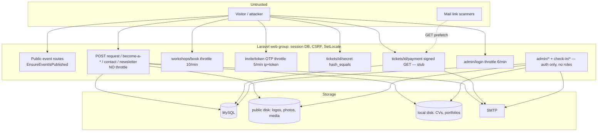

# Security / Authorization / DoS Audit — Event & Ticketing Platform (whole project)

Audit prompt: `claude-code-audit-prompts/laravel-mvc/02-security-dos-audit-claude-code.md`
Date: 2026-09-26 · Branch `main` @ `1d00644` · **Read-only.** No live systems were probed, no scanners run, no secrets printed. Runtime evidence comes from the local test suite, read-only local kernel requests, and one reproduction inside a rolled-back database transaction. Companion: `security-findings.json`. Commit-scoped report for the invitations feature: `audits/invitations-4f3ff4c-1d00644/SECURITY_AUDIT_REPORT.md`.

---

## 1. Executive Summary

The application code is **secure by construction in the places attackers usually go first**:
- no SQL injection surface (Eloquent and bindings only);
- all rich text sanitized on write with a strict allowlist;
- CSRF on every state-changing route;
- unguessable 40-character capabilities for tickets and invitations, compared in constant time;
- private storage for CVs;
- SVG uploads filtered;
- event-scoped ownership checks on every nested admin route.

The Git history holds no real secrets.

The risks are about **abuse, privilege design and business-logic integrity**, not injection:

| ID | Finding | Severity |
|---|---|---|
| SEC-01 | No rate limiting on public forms that **send email to any address** and **store uploads** (ticket request, speaker/sponsor applications, contact, newsletter) | **Medium** |
| SEC-02 | **No roles**: every login is a full admin, including door staff using the check-in page | **Medium** |
| SEC-03 | Payment is a **stub**: an approval link issues a paid ticket with no charge; a GET link can be triggered by email link scanners | **Medium** |
| SEC-04 | Review actions have no server-side Pending guard: re-approving an issued ticket locks the attendee out (runtime-reproduced) | **Medium** |
| SEC-05 | Coupon usage limit can be exceeded concurrently | Low |
| SEC-06 | No security headers set by the app (CSP, HSTS, X-Frame-Options, nosniff, Referrer-Policy) | Low · NEEDS INFRASTRUCTURE VERIFICATION |
| SEC-07 | Production-config assumptions (`APP_DEBUG`, secure cookie, log level) unverifiable from the repo | Low · NEEDS PRODUCTION VERIFICATION |
| SEC-08 | Admin seeder falls back to a default password | Low · NEEDS PRODUCTION VERIFICATION |
| SEC-09 | Event slug unrestricted and reflected into a SweetAlert `html` template | Low |
| SEC-10 | Invitation OTP limiter per IP; no session regeneration after OTP | Low |
| SEC-11 | Destructive cascades: deleting a ticket type deletes paid tickets | Low (integrity) |
| SEC-12 | Dev-only `postcss` advisory | Informational |
| SEC-13 | Git-history secret scan: one hit, a documentation placeholder | Informational |

**0 Critical · 0 High · 4 Medium · 7 Low · 2 Informational.**

**Production decision: YES WITH ACCEPTED RISKS** — provided that:
- production `.env` has `APP_DEBUG=false` and `SESSION_SECURE_COOKIE=true` (SEC-07);
- the seeded admin password was overridden (SEC-08);
- the payment stub is an accepted business decision (SEC-03).

Apply per-route rate limiting (SEC-01) before promoting the public forms widely.

## 2. Security Architecture



**Trust boundaries:**
1. The internet talks to public routes, protected only by capability tokens and validation.
2. Authenticated admins have full control; there's no internal boundary.
3. The app talks to SMTP; the recipient address comes from untrusted input.

## 3. Route / Attack Surface Inventory

There are 173 routes. The public state-changing ones:

| Route | Throttle | CSRF | Side effects | Status |
|---|---|---|---|---|
| `POST contact` (`routes/web.php:58`) | ✗ | ✅ | DB row | SEC-01 |
| `POST events/{event}/request` (`:75`) | ✗ | ✅ | DB rows, files (local disk, ≤5 MB per CV/PDF field), coupon use, **email to submitted address** (`TicketRequestController.php:68`) | SEC-01 |
| `POST events/{event}/become-a-sponsor` (`:77`) | ✗ | ✅ | DB row, **4 MB image on public disk**, **email** (`SponsorRequestController.php:33`) | SEC-01 |
| `POST events/{event}/become-a-speaker` (`:79`) | ✗ | ✅ | DB row, **4 MB image on public disk**, **email** (`SpeakerRequestController.php:33`), unbounded bio | SEC-01 |
| `POST events/{event}/contact` (`:80`) | ✗ | ✅ | DB row | SEC-01 |
| `POST events/{event}/newsletter` (`:81`) | ✗ | ✅ | DB row (`firstOrCreate`) | SEC-01 (low) |
| `POST events/{event}/workshops/book` (`:69`) | 10/min | ✅ | session | OK |
| `POST events/{event}/workshops/picker` (`:71`) | ✗ | ✅ | bookings; needs an authenticated session | OK |
| `POST events/{event}/invite/{token}` (`:83`) | 5/min ip+token | ✅ | session | SEC-10 |
| `POST events/{event}/invite/{token}/request` (`:85`) | ✗ | ✅ | 1 row + 1 email, once per invitation | OK |
| `GET tickets/{ticket}/payment` (`:90`) | ✗ | n/a (GET, signed) | **issues the ticket + email** | SEC-03 |
| `GET tickets/{ticket}/{ticketId}` | ✗ | n/a | read-only | OK |
| `POST admin/login` (`:107`) | 6/min | ✅ | session | OK |

Admin: 143 routes plus 3 check-in routes, all behind `auth` (`routes/web.php:99,110`). The full authorization matrix is in §27.

## 4. Security-Critical Feature Matrix

| Control | Status | Evidence |
|---|---|---|
| Guest blocked from admin | VERIFIED EFFECTIVE | `redirectGuestsTo(admin.login)` in `bootstrap/app.php`; `tests/Feature/Admin/AuthTest.php` |
| Cross-event IDOR on admin nested resources | VERIFIED EFFECTIVE | `assertBelongsToEvent` pattern; per-CRUD 404 tests (e.g. `SpeakerCrudTest::test_editing_a_speaker_from_another_event_returns_404`) |
| Ticket page capability | STATICALLY VERIFIED | `app/Http/Controllers/TicketController.php:24` `hash_equals`, 40-char secret |
| Check-in scoped to event, atomic | VERIFIED EFFECTIVE | `app/Services/TicketCheckIn.php:32-58`; `Admin/TicketCheckInTest` |
| Workshop key constant-time | STATICALLY VERIFIED | `app/Services/WorkshopBooker.php:58` |
| Draft events hidden | VERIFIED EFFECTIVE | `EnsureEventIsPublished`; `DraftEventVisibilityTest` |
| Rich-text XSS | VERIFIED EFFECTIVE | `SanitizedRichText` cast + `RichText::clean`; `tests/Unit/RichTextTest.php`; `LandingPageContentCrudTest::test_rich_text_fields_are_sanitized_on_save` |
| SVG upload XSS | VERIFIED EFFECTIVE | `app/Rules/SafeSvg.php`; `SafeSvgUploadTest` |
| Server-side review state guard | **VERIFIED BROKEN** | SEC-04 reproduction |
| Rate limit on public forms | **ABSENT** | SEC-01 |
| Role separation | **ABSENT** | SEC-02 |

## 5. Authentication Findings

- Admin login: `Auth::attempt` + `session()->regenerate()` (`app/Http/Controllers/Admin/AuthController.php:28,34`); logout invalidates the session and rotates the token (`:41-43`); throttled 6/min (`routes/web.php:107`). There's a single generic error message, so accounts can't be enumerated.
- Passwords use the `hashed` cast with bcrypt, `BCRYPT_ROUNDS=12` (`app/Models/User.php:46`).
- There's no registration, password reset or MFA. Admins are created only through the seeder, which shrinks the attack surface.
  - **SEC-08 (Low):** `config/admin.php:20` falls back to the `password123` default when `ADMIN_SEED_PASSWORD` is unset. The seeder prints a warning (`database/seeders/AdminUserSeeder.php:34-39`). **NEEDS PRODUCTION VERIFICATION** that the live admin password was set explicitly.
  - Informational: consider MFA or an IP allowlist for `/admin` at the web-server level, since one password protects everything (SEC-02).
- Invitations: SEC-10 (see the commit report: INV-S01 and INV-S02).

## 6. Authorization / RBAC / Ownership

### SEC-02 — Single privilege level; check-in staff are full admins (Medium)
- **Evidence:** `routes/web.php:99` (check-in) and `:110` (admin) both use plain `auth`. `app/Models/User.php` has no role column. There are no Gates or Policies (`app/Policies` doesn't exist).
- **Conflict with the domain spec:** `.claude/skills/event-domain.md:79` says the QR registration portal is "distinct from the admin dashboard".
- **Attack path:** any account given to door staff (often temporary workers, sometimes a shared login) can:
  - approve its own or friends' ticket requests;
  - generate invitations and issue free tickets;
  - export attendee PII (`admin/events/{event}/reports/export`);
  - delete events or ticket types (SEC-11).
- **Impact:** insider fraud and bulk exposure of attendee personal data.
- **Fix:** add a `role` (admin / checkin) with middleware or Gates, limit the check-in role to `check-in.*`, and default new users to the least privilege.
- CVSS 3.1: 6.3 (AV:N/AC:L/PR:L/UI:N/S:U/C:L/I:L/A:L). OWASP A01.

Everything else in this area is well covered:
- Ownership: every nested admin controller checks `model->event_id === event->id`, and it's tested.
- Public lookups are scoped through `$event->…()` relations.
- Mass assignment: models use `$fillable`, and controllers pass `validated()`/`safe()` data. `status`, `is_paid` and `ticket_id` never come from public input.

## 7. CSRF / Session

- CSRF: the default `web` middleware applies to all POST/PUT/PATCH/DELETE routes; there are no exemptions (`bootstrap/app.php` adds none). Check-in `fetch` calls send the token.
- **State-changing GET:** `tickets/{ticket}/payment` (SEC-03).
- Session: database driver, `http_only=true`, `same_site=lax`, 120 minutes (`config/session.php:185,202,35`).
  - `secure` comes from `SESSION_SECURE_COOKIE`, which isn't set in `.env.example`, so it defaults to null/false (`config/session.php:172`).
  - `SESSION_ENCRYPT=false`.
  - **SEC-07 — NEEDS PRODUCTION VERIFICATION.**
- `SetLocale` writes the session on every request (`app/Http/Middleware/SetLocale.php:19`), which is harmless for security.

## 8. Validation / Injection / Mass Assignment

- No `DB::raw`, `whereRaw` or `orderByRaw` with user input. Dynamic filters (`?status=`) are compared with `where('status', $status)` using bindings, so they're safe.
- No shell or `exec` usage.
- File paths are generated by `store()` (hashed names); downloads resolve stored paths only after checking ownership (`Admin/TicketRequestQueueController.php` `downloadAnswer`).
- Phone, email and name validation is strict. **CR-13:** the speaker bio has no length limit (`app/Http/Requests/SpeakerRequestStoreRequest.php:24-25`).

## 9. XSS

- All 19 `{!! !!}` outputs render fields sanitized on write:
  - `SanitizedRichText` on `Speaker`, `Workshop`, `TicketType`, `Faq`, `SiteFaq`, `HeroSlide`, `AudienceTab`, `AudienceCard` and `Testimonial`;
  - `RichText::clean` in `LandingPageContentController` and `SiteContentController`.
- The `cms` Purifier profile allows only `p, br, strong, b, em, i, h2-h4, ul, ol, li, a[href], blockquote`, with http/https/mailto URIs and no `style`, `class`, `id` or `on*` attributes (`config/purifier.php`). Stored XSS through the CMS is mitigated.
- Alpine `x-text` is used, and there's no `x-html`.
- **SEC-09 (Low):** SweetAlert2 builds `html` from `reference` (`resources/js/app.js:93-96`). `reference` is the ticket number derived from the event slug, and the slug accepts any characters (`app/Http/Requests/Admin/EventRequest.php:25`), so an admin could inject markup into every visitor's success popup. It requires admin access (already total), so it's Low. **Fix:** `alpha_dash` on the slug, and use `text`/`textContent` for the reference.

## 10. File Upload / Storage

| Upload | Rule | Disk | Served | Verdict |
|---|---|---|---|---|
| Public speaker photo / sponsor logo | `image` (no SVG), ≤4 MB | public | yes | OK; storage-abuse risk (SEC-01) |
| Ticket CV / portfolio PDF | `mimes:pdf,doc,docx`, ≤5 MB | **local (private)** | admin download, ownership-checked | Good |
| Admin logos/favicons | `image:allow_svg` + `SafeSvg` | public | yes | Good |
| Admin reels | `mimetypes:video/mp4,webm,quicktime`, ≤25 MB | public | yes | OK |

- Filenames are hashed, so there's no path traversal and nothing executable (`.htaccess` rewrites to `index.php`, and images and PDFs aren't executable).
- **NEEDS INFRASTRUCTURE VERIFICATION** that the public storage directory on Plesk doesn't run PHP.

## 11. SSRF

None. The app stores user URLs (social links, websites) but never fetches them. No outbound HTTP client usage was found.

## 12. Rate Limiting / Abuse

### SEC-01 — Public forms are unthrottled (Medium)
**Evidence:** `routes/web.php:58,75,77,79,80,81`. Only login, workshop booking and the invitation OTP are throttled.

**Abuse paths:**
- **Email bombing / sender-reputation damage.** Each ticket request, speaker application and sponsor application sends an email to whatever address was submitted (`TicketRequestController.php:68`, `SponsorRequestController.php:33`, `SpeakerRequestController.php:33`). A script can make your domain spam a third party, getting it blocklisted, which would also stop real ticket emails.
- **Storage exhaustion.** Each speaker or sponsor application stores a ≤4 MB image on the public disk, and each ticket request can store several ≤5 MB documents on local disk.
- **Admin queue flooding.** Junk ticket requests and applications bury real ones (there's no pagination either, CR-07).
- **Coupon enumeration.** The ticket request reports whether a code applied, so codes can be guessed at full request speed.

**Impact:** availability of email delivery and disk, plus admin workload. **Fix:** named limiters, e.g. `throttle:5,1` per IP on the form POSTs and a daily cap per email address. Consider a honeypot field or Cloudflare Turnstile on public forms.

CVSS 3.1: 5.3 (AV:N/AC:L/PR:N/UI:N/S:U/C:N/I:N/A:L). OWASP A04.

## 13. Secrets / Configuration

- `.env` is gitignored and was never committed (history scan, §14).
- **SEC-07 (Low, NEEDS PRODUCTION VERIFICATION):** `.env.example` ships `APP_DEBUG=true`, `LOG_LEVEL=debug`, `APP_ENV=local`, and has no `SESSION_SECURE_COOKIE`. If production was copied from it, debug pages would leak stack traces and environment values. Confirm the production `.env` has `APP_ENV=production`, `APP_DEBUG=false`, `SESSION_SECURE_COOKIE=true`, `LOG_LEVEL=warning`, and an `APP_URL` using https.

## 14. Git History Secret Review

- 191 commits searched across all refs. File names: no `.env`, keys, `.pem`, credentials or `auth.json` ever committed.
- Content patterns searched: `APP_KEY=base64`, `sk_live_`/`sk_test_`, `AKIA…`, private keys, `MAIL_PASSWORD=`, `DB_PASSWORD=`, `ghp_`, Slack tokens, Google API keys. **One hit:** `STRIPE_SECRET=sk_live_abc1…` in `.claude/skills/laravel-best-practices/rules/config.md:30` (added in `6c6db80`). The value is 14 characters — a documentation example shipped with Laravel Boost, not a key (real Stripe keys are about 100 characters). **SEC-13: FALSE POSITIVE.**

## 15. Password / Cryptography

- bcrypt, 12 rounds, `hashed` cast. Secrets come from `Str::random` (CSPRNG) and `random_int`.
- Signed URLs use `URL::temporarySignedRoute` (HMAC with `APP_KEY`, 7-day expiry).
- `hash_equals` everywhere a secret is compared. No custom cryptography.

## 16. Security Headers

**SEC-06 (Low, NEEDS INFRASTRUCTURE VERIFICATION):** there's no header middleware in `bootstrap/app.php`, and `public/.htaccess` sets no headers. Missing:
- Content-Security-Policy;
- Strict-Transport-Security;
- X-Frame-Options / `frame-ancestors` (so the admin can be framed: clickjacking);
- X-Content-Type-Options;
- Referrer-Policy — this matters because ticket and invitation capability URLs could leak through `Referer` to external links on those pages.

Plesk or nginx may add some of these. **Fix:** a small middleware that sets them; start the CSP in report-only mode because of inline Alpine and scripts.

## 17. Database Security

- The app never connects to production for this audit. Credentials come from env.
- Queries use bindings throughout.
- Destructive cascades: **SEC-11 (Low, integrity)** — deleting a ticket type deletes paid tickets (`database/migrations/2026_08_01_100000_create_tickets_table.php:16`, `app/Http/Controllers/Admin/TicketTypeController.php:61`). Combined with SEC-02, any staff login can do it.
- Backups and TLS to the DB: **NEEDS INFRASTRUCTURE VERIFICATION.**

## 18. Logging / Information Disclosure

- Mail failures log model IDs and the exception, not PII payloads or secrets (e.g. `TicketRequestController.php` catch block).
- `MAIL_MAILER=log` locally writes full emails, including signed payment URLs and ticket links, to `storage/logs`. Make sure production uses SMTP. **NEEDS PRODUCTION VERIFICATION.**
- No debugbar or Telescope installed.
- The attendee CSV export (`reports/export`) contains PII and is available to every admin (SEC-02).

## 19. Dependency / Supply Chain

| Check | Result |
|---|---|
| `composer audit` | No advisories (VULNERABLE: none) |
| `npm audit --omit=dev` | 0 vulnerabilities |
| `npm audit` (incl. dev) | `postcss`: 1 high, 1 moderate — **build-time only** (SEC-12) |
| OUTDATED | Laravel 13 available (12 supported); Boost, Pint and Sail have minor updates |
| ABANDONED | none |
| UNUSED | `axios` (see CR-11) |
| Git/private deps, install scripts | none |

## 20. Queue / Webhook Security

There are no queues, jobs or webhooks. Payment has no webhook yet (SEC-03). When a gateway is added, verify signatures, check timestamps and replays, and confirm payment server-to-server, never from a browser redirect.

## 21. Business Logic / Race Conditions

### SEC-04 — Review actions without a Pending guard (Medium) — VERIFIED BROKEN
- **Reproduction** (tinker, inside `DB::beginTransaction()` … `DB::rollBack()`): create a `TicketIssued` ticket, then `PATCH admin/events/ccs-2026/ticket-requests/{id}/approved` → 302, and the status is `payment_pending`. Approving the same sponsor request twice produced 2 sponsors.
- **Code:** `app/Http/Controllers/Admin/TicketRequestQueueController.php:49-59`, `SponsorRequestController.php:55-64`, `SpeakerRequestController.php:42-53`.
- **Impact:** a demoted ticket fails check-in (`TicketCheckIn.php:53` requires `TicketIssued`), so a paying attendee is turned away. A new payment email is sent. With SEC-03, re-paying rotates the QR secret.
- The actor must be authenticated and pass CSRF, so this isn't externally exploitable. But double-clicks and stale tabs trigger it accidentally, and SEC-02 widens who can do it deliberately.
- **Fix:** lock and check Pending (the pattern in `Admin/InvitationRequestController.php:52-57`).
- OWASP A04.

### SEC-05 — Coupon usage limit race (Low)
Check-then-increment (`app/Services/CouponRedeemer.php:30,61`). A public attacker with a valid limited code can redeem it more than `usage_limit` times with parallel requests. **Fix:** a conditional atomic increment. CVSS 3.1: 3.7 (AV:N/AC:H/PR:N/UI:N/S:U/C:N/I:L/A:N).

### SEC-03 — Payment stub issues tickets without charge (Medium)
`app/Http/Controllers/TicketPaymentController.php:18-41` plus the signed GET route `routes/web.php:90`.
- Everyone approved gets a free ticket by clicking the link. The signed link is forwardable for 7 days, but it only issues the ticket to the email already on the request.
- Because it's a GET, Outlook Safe Links and similar scanners may complete it automatically.
- There's also a double-visit race that rotates the QR (CR-05).
- **Fix:** integrate a gateway, confirm payment by webhook, make completion a POST, or accept free issuance explicitly.

Other flows are correct:
- Check-in is atomic.
- Workshop capacity is lock-protected.
- Invitation submission and review are lock-protected.
- Newsletter sign-up is `firstOrCreate` under a unique (`event_id`, `email`) index.

## 22. Dead Security Code / Attack Surface

| Item | Classification |
|---|---|
| `resources/views/admin/check-in/*` (old check-in UI) | CONFIRMED DEAD — no route renders it |
| `resources/views/welcome.blade.php` | CONFIRMED DEAD |
| `resources/js/bootstrap.js` + `axios` | CONFIRMED DEAD |
| `TicketCheckIn::ticketIdFrom()` accepting legacy URL QR codes (`app/Services/TicketCheckIn.php:79-92`) | LEGACY BUT REACHABLE — intentional backward compatibility, extracts only a strict 40-character token; OK |
| `/up` health route | ACTIVE, harmless |

## 23. DoS / Resource Exhaustion

| Surface | Public? | Expensive Operation | Rate Limit | Hard Input Limit | Async Work | Abuse Risk | Status |
|---|---|---|---|---|---|---|---|
| `POST events/{e}/request` | Yes | txn + file store (N×5 MB) + SMTP | ✗ | per-field max; `post_max_size` 30 MB | sync mail | **High** (mail + disk) | SEC-01 |
| `POST become-a-speaker` | Yes | 4 MB image + SMTP | ✗ | image 4 MB; bio unbounded | sync mail | **High** | SEC-01 / CR-13 |
| `POST become-a-sponsor` | Yes | 4 MB image + SMTP | ✗ | 4 MB | sync mail | **High** | SEC-01 |
| `POST contact` (×2) | Yes | 1 insert | ✗ | 5000 chars | no | Medium (DB spam) | SEC-01 |
| `POST newsletter` | Yes | firstOrCreate | ✗ | email | no | Low | SEC-01 |
| Landing / home GET | Yes | 11–17 queries, 45–130 KB | ✗ | — | no | Low (cacheable) | OK |
| `GET tickets/{id}/{secret}` | Yes | QR PNG render | ✗ | — | no | Low (needs a valid secret, else 404 first) | OK |
| `GET tickets/{id}/payment` | Yes | QR + SMTP | ✗ | signed | sync | Low (signature checked first) | OK |
| Invitation OTP | Yes | 1 query | 5/min | digits:6 | no | Low | OK |
| Admin reports / CSV export | Admin | 34–35 queries; full attendee export | ✗ | — | sync | Low (admin) | OK |
| Every request | Yes | DB session write | ✗ | — | — | Low (session table growth) | CR-14 |

**Infrastructure-level DDoS readiness:** no nginx/Apache limits, WAF or CDN config are in the repo, only the `.user.ini` upload limits. **NEEDS INFRASTRUCTURE VERIFICATION** (Plesk, nginx `client_max_body_size`, Cloudflare/WAF). Laravel code alone gives no DDoS protection.

## 24. Security Rewrite Opportunities

| Area | Current | Concrete benefit of redesign |
|---|---|---|
| Review transitions | 4 hand-written controllers, only 1 guarded | A shared locked `transitionFromPending()` fixes SEC-04 everywhere and prevents recurrence |
| Authorization | `auth` only | Role + Gate model gives least privilege for door staff (SEC-02) |
| Payment completion | GET + stub + race | A POST, webhook-confirmed `TicketIssuer` closes SEC-03, CR-05 and link-scanner auto-completion |
| Public forms | no limiter | Central named limiters in `AppServiceProvider` (the pattern already exists for `invitation-otp`) |

## 25. Security Controls Done Well

1. Sanitize-on-write as a model cast, with a strict purifier allowlist that matches the CKEditor toolbar.
2. Capability URLs: 40-character CSPRNG secrets, `hash_equals`, and uniform 404s / identical invalid pages (no existence oracle).
3. Atomic check-in with event scoping, so a ticket from one event can't be used at another.
4. Row locking for workshop capacity and invitations.
5. `SafeSvg` validation; non-SVG `image` rule for public uploads; private disk for documents with ownership-checked downloads.
6. Consistent ownership checks on nested admin routes, with tests.
7. Login throttle, session regeneration, and a proper logout.
8. No secrets in Git history; `.env` never committed.
9. Clean production dependency audit.

## 26. Production Security Checklist

| Item | State |
|---|---|
| `APP_ENV=production`, `APP_DEBUG=false` | NEEDS PRODUCTION VERIFICATION |
| `SESSION_SECURE_COOKIE=true`, https `APP_URL` | NEEDS PRODUCTION VERIFICATION |
| Admin password overridden (not the seed default) | NEEDS PRODUCTION VERIFICATION |
| Real SMTP (not `log`) | NEEDS PRODUCTION VERIFICATION |
| Security headers (CSP/HSTS/XFO/nosniff/Referrer) | Missing in app; NEEDS INFRASTRUCTURE VERIFICATION |
| Public storage can't execute PHP | NEEDS INFRASTRUCTURE VERIFICATION |
| Rate limits on public forms | Missing (SEC-01) |
| Role separation for door staff | Missing (SEC-02) |
| Payment gateway | Stub (SEC-03) |
| DB backups | NEEDS INFRASTRUCTURE VERIFICATION |

## 27. Route Authorization Matrix (grouped)

| Route group | Guest | Any admin | Role-restricted | Event-scoped | Destructive |
|---|---|---|---|---|---|
| Public event pages / forms | ✅ | ✅ | — | ✅ (published only) | creates rows |
| `tickets/{id}/{secret}`, `payment` | capability | — | — | via ticket | payment issues ticket |
| `check-in/{event}*` | ✗ | ✅ | **✗ should be check-in role** | ✅ | admits attendee |
| `admin/events/{event}/…` CRUD (speakers, sponsors, workshops, FAQs, gallery, reels, testimonials, agenda, ticket types, coupons, request fields, influencer categories, content) | ✗ | ✅ | ✗ | ✅ | delete (ticket types: cascade to tickets) |
| `admin/events/{event}/…-requests` reviews | ✗ | ✅ | ✗ | ✅ | ✗ no Pending guard (except invitations) |
| `admin/events/{event}/invitations` | ✗ | ✅ | ✗ | ✅ | issues free tickets |
| `admin/events/{event}/reports[/export]` | ✗ | ✅ | ✗ | ✅ | PII export |
| `admin/events` CRUD, hub content, site FAQs, hero, partners, audience tabs | ✗ | ✅ | ✗ | n/a | delete event (cascades everything) |

## 28. Prioritized Remediation Roadmap

1. **Before event day:**
   - SEC-04 Pending guards (S);
   - SEC-02 check-in role (M);
   - SEC-11 restrict ticket-type deletion (S);
   - verify SEC-07 and SEC-08 in production (XS).
2. **Before promoting the public forms:** SEC-01 rate limits plus a per-email cap (S).
3. **Soon:**
   - SEC-06 header middleware (S);
   - SEC-05 atomic coupon increment (XS);
   - SEC-09 slug `alpha_dash` + `textContent` (XS);
   - SEC-10 OTP per-token cap and session regeneration (XS).
4. **When selling tickets:** SEC-03 gateway with webhook confirmation and POST completion (L).

## 29. Production Decision

**YES WITH ACCEPTED RISKS**, conditional on the verification items in §26 and on the payment stub being an explicit business decision. Application-level injection, XSS and IDOR controls are sound. The open risks are abuse (rate limits), privilege separation and review-state integrity.

## 30. Coverage & Limitations

- **Reviewed:** all routes; bootstrap and middleware; auth; every public controller and its FormRequest; every admin review controller; payment, ticket and check-in; the workshop booker; the coupon redeemer; upload handling; the purifier config; all `{!! !!}` sites; the JS entry points; session, app and media config; `.env.example`; `.htaccess`/`.user.ini`; migrations for tickets and invitations; seeders; Git history; lockfiles.
- **Runtime:**
  - the test suite;
  - read-only kernel GETs;
  - one rolled-back reproduction.
- **Not performed:**
  - live, staging or production testing;
  - scanners;
  - brute force;
  - load/DoS;
  - browser/E2E;
  - infrastructure review (Plesk/nginx/WAF/TLS/backups are outside the repo).

## Security Architecture Quality — SOLID / ACID / Patterns

| Area | Principle | Status | Evidence | Impact | Recommendation |
|---|---|---|---|---|---|
| Review controllers | SRP / DRY | ISSUE | transition logic ×4, guard ×1 | SEC-04 | Shared guarded transition |
| Authorization | DIP / policy | NEEDS IMPROVEMENT | `auth` only, no Gates | SEC-02 | Gates per role |
| Sanitization | SRP | PASS | cast owns sanitizing | — | — |
| Capability checks | — | PASS | `hash_equals` in the service/controller | — | — |

| Workflow | A | C | I | D | Status |
|---|---|---|---|---|---|
| Role/permission changes | n/a (no roles) | | | | — |
| Ticket review | ✗ guard | ✗ | ✗ | mail before update | ISSUE |
| Payment completion | ✗ | ✅ | ✗ | mail not retried | ISSUE |
| Coupon redemption | ✅ txn | ✅ | ✗ | ✅ | ISSUE |
| Check-in | ✅ | ✅ | ✅ | ✅ | PASS |
| Invitations | ✅ | ✅ | ✅ | ⚠ mail in txn | PASS/ISSUE |

| Pattern | Classification |
|---|---|
| Policy/Gate for staff roles | MISSING PATTERN (solves SEC-02) |
| State guard on review statuses | MISSING PATTERN (solves SEC-04) |
| Outbox-lite (queued mail `afterCommit`) | MISSING PATTERN (solves CR-05/INV-S03) |
| Idempotent payment completion | MISSING PATTERN (SEC-03/CR-05) |
| Capability tokens | APPROPRIATE AS-IS |
| Sanitizing cast | APPROPRIATE AS-IS |

| Improvement | Type | Value | Effort | Priority |
|---|---|---|---|---|
| Named limiters for public forms | Security | High | S | DO NOW |
| Check-in role | Security | High | M | DO NOW |
| Header middleware (CSP report-only first) | Security | Medium | S | DO SOON |
| Admin audit log (who approved/deleted what) | Observability | Medium | M | DO SOON |
| MFA or IP allowlist for `/admin` | Security | Medium | M | OPTIONAL |

## Appendix — Commands Executed

```
php artisan route:list --except-vendor
php artisan test --compact                              # 660 passed
grep: {!! !!}, x-html/innerHTML, DB::raw, throttle/RateLimiter, regenerate, hash_equals, lockForUpdate, Storage disks
sed/cat: config/session.php, config/purifier.php, config/media.php, config/admin.php, .env.example (values redacted), public/.htaccess, public/.user.ini
git log --all --name-only | grep sensitive names ; git log --all -p -G'<secret patterns>' (values masked; length-only inspection)
composer audit ; npm audit --omit=dev ; npm audit
php artisan tinker '<DB::beginTransaction(); re-approve issued ticket; approve sponsor twice; DB::rollBack()>'
```

Source code was not modified. No secrets were printed.
