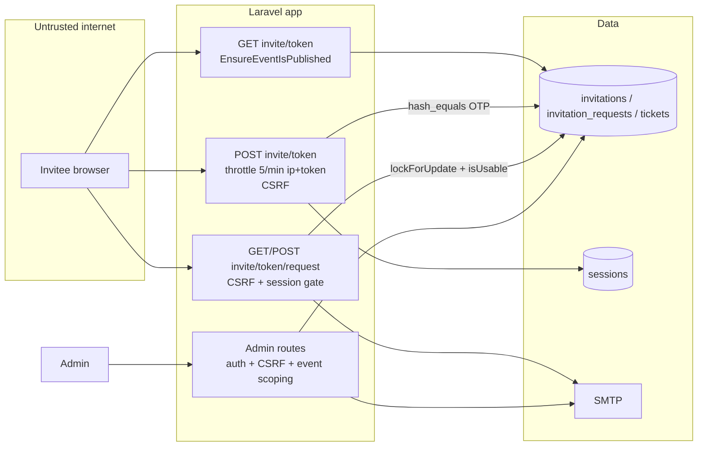

# Security / Authorization / DoS Audit — Event Invitations (commits `4f3ff4c`, `1d00644`)

Scope: the invitation feature only. Audit prompt: `laravel-mvc/02-security-dos-audit-claude-code.md`, applied to a commit range. Read-only. No live systems were touched; runtime checks are the local test suite. Companion: `security-findings.json`.

## 1. Executive Summary

The invitation flow is a public, login-free entry point that ends in a free ticket, so it's the most security-sensitive feature added recently. **No Critical, High or Medium vulnerabilities were found.** Access needs three things together:
1. a 40-character random token (CSPRNG, `Str::random`);
2. a 6-digit OTP (CSPRNG, `random_int`), compared in constant time and rate-limited;
3. a server-side session entry tied to that exact invitation.

Every step re-checks that the invitation is still usable. Single use is enforced both by a row lock and by a unique FK. All admin actions check that the model belongs to the event in the URL.

Findings: **0 Critical, 0 High, 0 Medium, 3 Low, 3 Informational.**

**Production decision for this feature: YES WITH ACCEPTED RISKS** (the Low items below).

## 2. Security Architecture / Trust Boundaries



## 3. Route / Attack Surface Inventory

| Route | Public? | CSRF | Throttle | Authorization | Notes |
|---|---|---|---|---|---|
| `GET events/{event}/invite/{token}` | Yes | n/a | none | token lookup scoped to event | Same page for every invalid case |
| `POST events/{event}/invite/{token}` | Yes | ✅ | `invitation-otp` 5/min by `ip|token` | token + `hash_equals` OTP | `app/Providers/AppServiceProvider.php:31-32` |
| `GET events/{event}/invite/{token}/request` | Yes | n/a | none | session id must equal the token's invitation id, plus `isUsable()` | `app/Http/Controllers/InvitationRequestController.php:87-100` |
| `POST events/{event}/invite/{token}/request` | Yes | ✅ | none (gated by session) | as above + row lock | single email per invitation |
| `admin/events/{event}/invitations*` | No | ✅ | none | `auth`, event ownership | any admin |
| `admin/events/{event}/invitation-requests*` | No | ✅ | none | `auth`, event ownership, Pending lock | any admin |

## 4. Security-Critical Feature Matrix

| Control | Status | Evidence |
|---|---|---|
| Token unguessable | STATICALLY VERIFIED | `Str::random(40)` at `app/Http/Controllers/Admin/InvitationController.php:32`; unique column |
| OTP generation uses CSPRNG | STATICALLY VERIFIED | `random_int(100000, 999999)` at `:33` |
| OTP constant-time compare | STATICALLY VERIFIED | `hash_equals` at `app/Http/Controllers/InvitationController.php:34` |
| OTP brute force limited | VERIFIED EFFECTIVE | test `InvitationVerificationTest.php:32` gets 429 on the 6th attempt |
| Invalid-link oracle | VERIFIED EFFECTIVE | identical page for unknown/expired/used/revoked (`InvitationVerificationTest.php:47`) |
| Cross-event token reuse | VERIFIED EFFECTIVE | `InvitationVerificationTest.php:64`; lookups use `$event->invitations()` |
| Form without OTP | VERIFIED EFFECTIVE | `InvitationRequestSubmissionTest.php:22` redirects to verify |
| Single use / replay | VERIFIED EFFECTIVE | second submit rejected (`InvitationRequestSubmissionTest.php:32`); unique FK `…150005…:18`; lock `InvitationRequestController.php:41-45` |
| Double approval | VERIFIED EFFECTIVE | `InvitationRequestQueueTest.php:26` — second PATCH creates no ticket and sends no email |
| Admin cross-event IDOR | VERIFIED EFFECTIVE | `InvitationCrudTest.php:71`, `InvitationRequestQueueTest.php:78` → 404 |
| Mass assignment | STATICALLY VERIFIED | Controllers build explicit arrays from `validated()`; `status`/`ticket_id` aren't user-settable |
| Stored XSS via submitted fields | STATICALLY VERIFIED | Output is `{{ }}` only; URLs restricted to `http,https` (test rejects `javascript:`) |
| CSRF | STATICALLY VERIFIED | Default web middleware; all forms use `@csrf` |

## 5. Authentication Findings

### INV-S01 — OTP rate limit can be spread across IPs (Low)
- The limiter is keyed by `ip|token` (`app/Providers/AppServiceProvider.php:31-32`), with no per-invitation cap. An attacker who already has a link (for example a forwarded email) and controls many IPs can try more than 5 codes a minute against it: 10⁶ codes would need about 200,000 IP-minutes.
- **Prerequisite:** the 40-character token, which isn't guessable. **Impact:** the attacker could submit the invitation in the real invitee's place, but an admin still reviews every request.
- **Fix:** add a second limit keyed by token alone (e.g. 20 attempts per hour per invitation), and/or revoke after N failures.
- CVSS 3.1: 3.7 (AV:N/AC:H/PR:N/UI:N/S:U/C:N/I:L/A:N). OWASP A07.

### INV-S02 — Session ID is not regenerated after OTP success (Low)
`app/Http/Controllers/InvitationController.php:38` writes `invitation_verified.{event}` into the existing session. A fixed session (attacker-planted cookie) would carry the verified state. Session fixation needs a separate foothold, and the elevated state only lets someone submit one form that an admin then reviews. **Fix:** call `$request->session()->regenerate()` before `put()`. CVSS 3.1: 3.1. OWASP A07.

## 6. Authorization / RBAC / Ownership

Every admin action is behind `auth` and checks event ownership: `app/Http/Controllers/Admin/InvitationController.php:44-46`, and the start of `Admin/InvitationRequestController::updateStatus`. There's no role separation (project-wide finding SEC-02 in the root report). Every public lookup is scoped through `$event->invitations()`.

## 7. CSRF / Session

CSRF comes from the default `web` group. The session is database-backed. After a successful submission the flag is removed (`InvitationRequestController.php:73`). See INV-S02.

## 8. Validation / Injection / Mass Assignment

Nothing concatenates raw SQL. Input goes through `InvitationRequestStoreRequest`, which applies strict types, ranges, `url:http,https` and event-scoped category IDs. No mass-assignment exposure.

## 9. XSS

No new unescaped output. Admin links render user URLs in `href` (restricted to http/https) with `rel="noopener noreferrer"`.

## 10–11. Upload / SSRF

No uploads and no outbound requests using user-supplied URLs (profile URLs are only stored and displayed).

## 12. Rate Limiting / Abuse

- OTP: rate-limited (INV-S01).
- Form submission: no throttle, but it needs a verified session and can succeed only once per invitation, so it can't be used to amplify email.
- Public GET of the link page: no throttle. Guessing a 40-character token isn't feasible.

## 13–15. Secrets / Git / Crypto

No secrets added. OTPs are stored in plaintext on purpose (admins must be able to view them later) — **INV-S04 (Informational)**: anyone with DB or admin access can use open invitations. That's acceptable given the 7-day expiry, but consider hiding an OTP once its invitation is used.

## 16. Security Headers

No changes. Project-wide finding SEC-06 applies.

## 17. Database Security

Unique constraints enforce the invariants (`token`, `invitation_id`, `ticket_id`). Cascade deletes remove history when a ticket type is deleted (see INV-C06 in the code report).

## 18. Logging / Disclosure

Failures log only the request ID and the exception (`Admin/InvitationRequestController.php:104-108`); no OTP, token or email is logged. The user sees a generic message.

## 19. Dependencies

None added.

## 20. Queue / Webhook

None. Emails are synchronous — **INV-S03 (Low, integrity)**: emails are sent inside the review transaction, so a failed commit after a successful send leaves the guest holding a QR code for a ticket that was never saved. Details in the code report (INV-C02).

## 21. Business Logic / Race Conditions

| Race | Protected? | How |
|---|---|---|
| Two submissions on one invitation | ✅ | `lockForUpdate` + `isUsable()` re-check + unique FK |
| Submit vs revoke | ✅ | Revoke is a conditional UPDATE; submit re-checks under the lock |
| Two admins approve at once | ✅ | Request row lock + Pending check |
| Approve vs reject at once | ✅ | Same lock |
| Expiry during the flow | ✅ | `isUsable()` checked on show, verify, create and inside the store transaction |

**INV-S05 (Informational):** invitation tickets inflate revenue reports (INV-C01). It's an integrity issue, not an exploit, but anyone relying on reports for reconciliation will be misled.

## 22. Dead Security Code

None.

## 23. DoS / Resource Exhaustion

| Surface | Public? | Expensive Operation | Rate Limit | Hard Input Limit | Async Work | Abuse Risk | Status |
|---|---|---|---|---|---|---|---|
| GET invite page | Yes | 1 indexed lookup | none | token in URL | no | Low | OK |
| POST OTP | Yes | 1 lookup + compare | 5/min ip+token | `digits:6` | no | Low | OK |
| POST request form | Yes (session-gated) | 1 txn + 1 email | none (once per invitation) | all fields bounded | sync mail | Low | OK |
| Admin approve | No | QR PNG + 2 emails | none | — | sync | n/a (admin) | OK |

## 24. Security Rewrite Opportunities

None needed. The feature already follows the safer patterns: locking, scoped queries, constant-time comparison.

## 25. Controls Done Well

- A uniform invalid page (no oracle for whether a token exists).
- CSPRNG for both secrets.
- `hash_equals`.
- Row locks plus unique constraints.
- Event-scoped lookups everywhere.
- `url:http,https`.
- Bounded integers.
- A generic error message to the user, with detail only in the log.

## 26–29. Checklist / Matrix / Roadmap / Decision

| Route | Guest | Admin | Event-scoped | Destructive |
|---|---|---|---|---|
| invite show/verify/create/store | ✅ with token/OTP/session | — | ✅ | creates 1 request |
| admin invitations index/store/revoke | ✗ | ✅ | ✅ | revoke |
| admin invitation-requests index/updateStatus | ✗ | ✅ | ✅ | issues a ticket |

Roadmap:
1. INV-S02: regenerate the session on OTP success (XS).
2. INV-S01: add a per-token failure cap (XS).
3. INV-S03: send email after commit (S).

**Decision: YES WITH ACCEPTED RISKS.**

## 30. Coverage & Limitations

Every file in both commits was read and the 17 invitation tests were run. No penetration testing, no concurrent multi-process tests, no infrastructure review (TLS, WAF and headers are project-wide).

## SOLID / ACID / Patterns (security-relevant)

- **ACID:** submit, revoke and review are atomic and isolated via locks and conditional updates. The only gap is durability ordering of the review email (INV-S03).
- **Patterns:** Policy/Gate would matter only once roles exist (project-wide). Otherwise APPROPRIATE AS-IS.

## Appendix — Commands Executed

```
git show 4f3ff4c ; git show 1d00644
php artisan test --compact tests/Feature/Invitation*.php tests/Feature/Admin/Invitation*.php tests/Unit/Models/InvitationTest.php
grep for regenerate / hash_equals / lockForUpdate / RateLimiter in the changed files
```

Source code was not modified.
